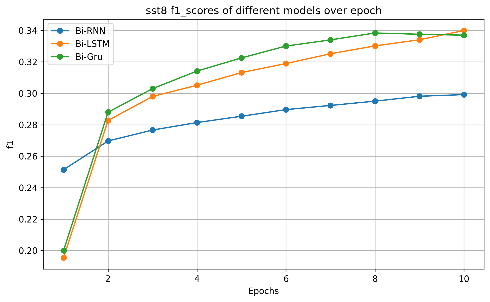
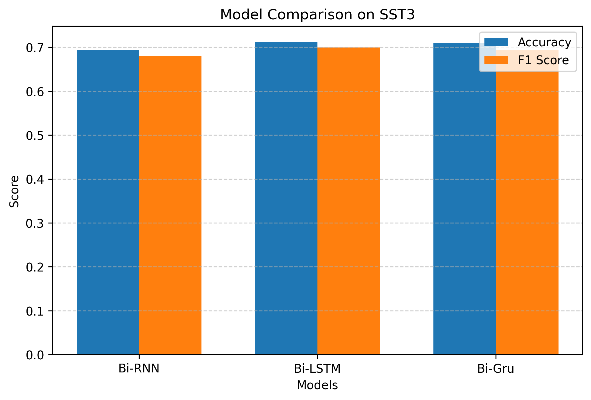

# Secondary Protein Structure Prediction

I worked on predicting the **secondary structure of proteins** from variable-length amino acid sequences. I wrote a detailed report on the project, which you can read on Medium: [Medium Article Link](your-medium-link).

The **inference API** for this project is fully containerized and available as a Docker image: [Docker Image Link](https://hub.docker.com/repository/docker/alokm7/protein2-api/general).  
The **project** is live and can be accessed here: [Click Here](https://secondary-protein-structure-prediction.onrender.com).

---

## Problem Statement

I tackled the challenge of **secondary protein structure prediction**, which involves predicting both **SST8** and **SST3** labels for each residue in a protein sequence. 
The variable lengths of protein sequences and subtle differences between secondary structure classes make this a challenging problem.

---

## My Approach

- I implemented **Bi-RNNs** (including LSTM, GRU, and vanilla RNN) and **Transformers** from scratch for sequence modeling.  
- I experimented with **transfer learning**, using pretrained models to improve predictions.  
- I compared all models using **SST8 and SST3 benchmarks**, and the results are included in the repo as charts.

---

## Results

I included **model comparison charts** in this repository showing the performance of all approaches on SST8 and SST3 prediction. These charts helped me analyze which models perform better under different conditions.

---

## Project Structure
src/
├─ data/ # Preprocessing scripts and data loader objects
├─ models/ # Model architectures
│ ├─ pretrained/ # ProtBERT loading and classifier head for transfer learning
│ ├─ Scratch/ # Bi-RNN, Bi-LSTM, Bi-GRU architectures
│ └─ transformer/ # Transformer architecture
├─ training1/ # Training logic for "from scratch" models
├─ training2/ # Training logic for pretrained models
├─ validation/ # Validation scripts and metrics
├─ plots/ # Plotting logic and all generated charts
└─ saved_models/ # Model checkpoints and saved weights

#This project is completely for learning purposes and was part of my academic coursework for the B.S. degree in Data Science at IIT Madras.

